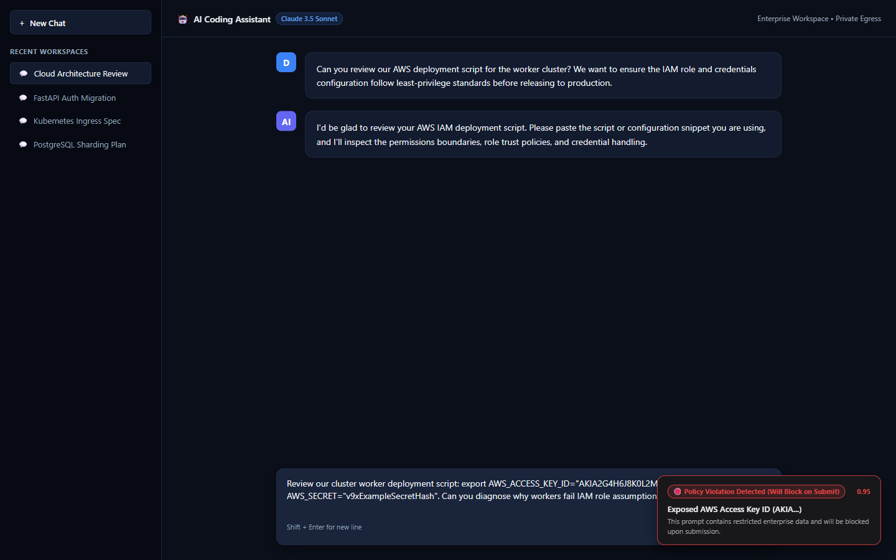
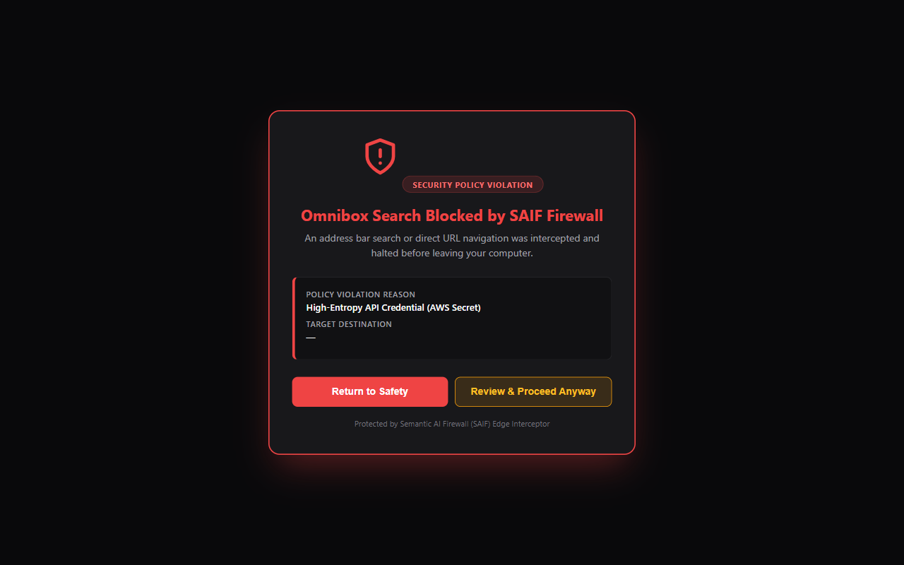
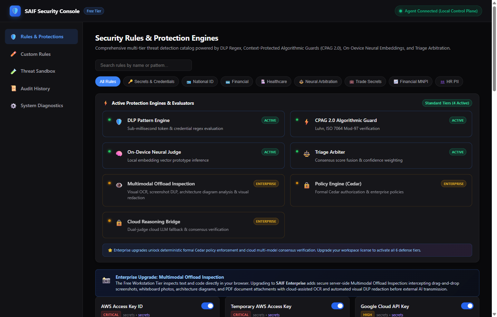

# Semantic AI Firewall (SAIF)
### The Zero-Trust Generative AI Security Layer for Developers

[](https://github.com/saif-project/saif-free-tier/releases)
[](LICENSE.md)
[](EULA.md)
[](docs/BENCHMARK.md)
[](docs/BENCHMARK.md)
[-orange.svg)](docs/USER_GUIDE.md)

**100% On-Device Prompt Interception • Zero Cloud Dependencies • Zero Telemetry**

[**Download SAIF-Setup.exe (v1.0.0 Beta)**](releases/SAIF-Setup.exe) • [**User Guide**](docs/USER_GUIDE.md) • [**Technical Whitepaper**](docs/BENCHMARK.md) • [**Rule Catalog**](docs/RULE_CATALOG.md)

---

## Visual Showcase: Protection in Action

SAIF operates transparently on your local workstation without synthetic testbed mockups. Here is what real-time enforcement looks like in everyday development:

### 1. In-Page AI Prompt Interception & Local Redaction
When sensitive credentials, keys, or proprietary data are entered into AI web apps (Claude, ChatGPT, Gemini, DeepSeek), SAIF halts outbound transmission before the request reaches the network. Developers can choose to auto-sanitize tokens locally or trigger an authorized break-glass override:

<p align="center">
  <a href="docs/screenshots/inpage_ai_chat_interception.png" title="Click to view full resolution">
    
  </a>
  <br>
  <sub><em>(Click image to view full resolution)</em></sub>
</p>

### 2. Ambient In-Composer Risk Warning
Before submission, SAIF monitors composer input in real-time, displaying a non-intrusive preflight risk badge if sensitive variables or confidential tokens are detected:

<p align="center">
  <a href="docs/screenshots/inpage_preflight_risk_card.png" title="Click to view full resolution">
    
  </a>
  <br>
  <sub><em>(Click image to view full resolution)</em></sub>
</p>

### 3. Omnibox (Address Bar) Search Interception
Developers frequently copy/paste API tokens, internal URLs, or credentials directly into their browser address bar, inadvertently submitting them to public search engine query logs. SAIF intercepts Omnibox navigation at the socket layer and blocks the query before it leaves the machine:

<p align="center">
  <a href="docs/screenshots/omnibox_blocked_showcase.png" title="Click to view full resolution">
    
  </a>
  <br>
  <sub><em>(Click image to view full resolution)</em></sub>
</p>

### 4. Workstation Options Console & Model Triad
Full visibility into active protection engines, algorithmic guards, and hot-swappable local models (`SAIF Light`, `SAIF Neural`, and `SAIF Deep Neural`):

<p align="center">
  <a href="docs/screenshots/dashboard_showcase.png" title="Click to view full resolution">
    
  </a>
  <br>
  <sub><em>(Click image to view full resolution)</em></sub>
</p>

### 5. Toolbar Popup Console
Instant workstation status, engine latency diagnostics, and 1-click protection snooze controls:

<p align="center">
  <a href="docs/screenshots/popup_showcase.png" title="Click to view full resolution">
    
  </a>
  <br>
  <sub><em>(Click image to view full resolution)</em></sub>
</p>

---

## What is SAIF?

**SAIF (Semantic AI Firewall)** protects developers and engineering organizations from accidentally leaking proprietary source code, cloud credentials, database connection strings, and sensitive PII to external AI services.

Traditional network firewalls, web proxies, and cloud DLP gateways fail on modern AI web traffic because prompt payloads transit through end-to-end encrypted WebSockets and single-page applications.

SAIF executes **directly on your workstation**, validating prompt payloads in sub-millisecond time on-device via a native Go security daemon and local ONNX neural cascades:

```
┌─────────────────────────────────────────────────────────┐
│  Developer inputs text in Browser, IDE, or Form Field   │
└────────────────────────────┬────────────────────────────┘
                             │ Intercepted locally on-device
                             ▼
┌─────────────────────────────────────────────────────────┐
│  SAIF Workstation Engine (http://127.0.0.1:18080)       │
│  • Recursive Syntactic De-Obfuscation Pipeline          │
│  • Mathematical Checksum Verification (Luhn, Mod-97)    │
│  • Shannon Information Entropy Analysis (H >= 3.2)      │
│  • Local ONNX Neural Semantic Cascade (<15ms)           │
└────────────────────────────┬────────────────────────────┘
                             │
               ┌─────────────┴─────────────┐
               ▼                           ▼
     [ Violation Detected ]      [ Clean Prompt ]
     In-page shield modal halts  Transits instantly to LLM
     outbound request & offers   (Zero noticeable latency)
     1-click local redaction
```

---

## Universal Surface Protection: Every Field & The Omnibox

SAIF is not a narrow chat wrapper. It enforces security boundaries across **the entire browser surface**:

1. **Every Web Input Field**: Monitors textareas, form inputs, comment boxes, and rich editors across **any website**—including GitHub pull request reviews, Jira issue descriptions, Slack web, internal dashboards, and enterprise portals.
2. **The Browser Omnibox (Address Bar)**: Intercepts browser navigation before HTTP requests leave the socket. If an engineer inadvertently pastes a tokenized URL (`https://api.internal/v1?token=eyJ...`) or credential into Google/Bing search bars, SAIF immediately redirects to a local safe page.
3. **Clipboard Paste Traps**: High-entropy credentials pasted into editable elements are intercepted in-place with instant sanitization.

---

## Deep Combinatorial DLP Engine (Beyond Basic Regex)

Rather than relying on brittle, easily bypassed pattern lists, SAIF employs a multi-stage **mathematical and information-theoretic inspection engine**:

* **Universal Mathematical Checksums**: Eliminates false positives on random numerical strings by enforcing exact checksum algorithms:
  * **ISO/IEC 7812 Luhn Mod-10** for payment cards.
  * **ISO 7064 Mod 97-10** for international bank account numbers (IBAN).
  * **Modulo-23** and regional parity checks for European fiscal codes.
* **Shannon Entropy Thresholding ($H \ge 3.2$)**: Evaluates character randomness to catch unformatted cryptographic secrets, private keys, and high-entropy API tokens even when they lack recognizable prefixes.
* **Recursive De-Obfuscation Pipeline**: Normalizes candidate payloads before rules execute:
  * Multi-pass Base64 and Hex unpacking.
  * Leetspeak transliteration ($3 \to e$, $0 \to o$, $@ \to a$).
  * Unicode NFKC canonicalization and homoglyph mapping.
  * URL percent-encoding resolution and template literal unwrapping.

---

## Three Production Models Available Out-of-the-Box

All three production models are included and hot-swappable directly in the Extension Console:

| Model | Memory (RAM) | Context Horizon | Latency ($P_{50}$) | Primary Workload |
| :--- | :--- | :--- | :--- | :--- |
| **`SAIF Light`** | ~35 MB | Context-Free | ~2.1 ms | Ultra-low overhead, credentials, terminal pastes, battery savings. |
| **`SAIF Neural`** | ~146 MB | 512 Tokens | ~13.8 ms | Real-time contextual analysis, web AI chats, Jira tickets, business prose. |
| **`SAIF Deep Neural`** | ~396 MB | 8,192 Tokens | ~21.5 ms | Full-file source code pasting, complex git diffs, whole-document IP. |

---

## Semantic Scope: Free Community vs. Pro & Enterprise

To provide a sustainable, enterprise-grade architecture, SAIF maintains a clear distinction between universal baseline security and organization-specific proprietary governance:

### Free Community Edition (What You Get Today)
* **Universal General Semantic Protection**: Pre-trained on broad software engineering concepts, open-source architectures, credential leakage, PII classifications, and universal trade secret terminology.
* **100% On-Device Sovereignty**: Completely self-contained local ONNX runtime with zero cloud phoning.
* **Full Model Triad Unlocked**: Free access to `SAIF Light`, `SAIF Neural`, and `SAIF Deep Neural`.

### Why Teams Upgrade to Pro & Enterprise
* **1-Click Custom Semantic Centroid Training**: Pre-trained models cannot know your organization's internal, unannounced project names (e.g. *"Project Titan"*, confidential microservice architectures, proprietary financial algorithms). Pro and Enterprise allow 1-click training on private Git repositories and internal documentation, generating bespoke semantic centroids without cloud data leakage.
* **Fleet-Wide Cedar Policy Dispatch**: Manage centralized, cryptographically signed policy-as-code manifests distributed to thousands of endpoints.
* **Streaming Enterprise SIEM Connectors**: Real-time audit telemetry streaming to Splunk, Datadog, and Syslog for SOC threat correlation.

---

## Development Roadmap & The Future Horizon

We are aggressively expanding SAIF from browser interception to a full-stack developer security layer. The following capabilities are in active development:

### 1. IDE Extensions & LSP Interceptors (In Active Development)
* **VS Code & JetBrains Native Sensors**: Inline prompt scanning directly within developer IDEs, catching sensitive data before it reaches AI assistants like GitHub Copilot, Cursor, or Continue.dev.
* **LSP-Native In-Editor Gutter Alerts**: Instant highlighting of exposed secrets in editor buffers with quick-fix redactions.

### 2. Transparent OS Network & Socket-Level Interception
* **Kernel & Socket Filtering Drivers**: Moving beyond browser extensions to transparent OS-level packet interception (Windows Filtering Platform [WFP], macOS NetworkExtension, Linux eBPF).
* **Zero-Config CLI & Script Protection**: Transparently inspects outbound AI API calls from `curl`, Python scripts, terminal clients, and background worker daemons without requiring manual proxy configuration.

### 3. Next-Generation Inspection Surfaces
* **Multi-Modal Clipboard OCR & Screenshot DLP**: Extracts and scans text from pasted screenshots, whiteboard photos, and architecture diagrams before vision models ingest them.
* **Deep Document Sanitization**: Pre-flight text extraction and inspection for PDF, DOCX, and XLSX attachments dropped into web AI chats.
* **Model Context Protocol (MCP) Tool Firewall**: Enforces Cedar authorization guardrails on autonomous agent tool invocations, protecting against indirect prompt injection attacks.
* **Local Model Gateway (Ollama / vLLM)**: Brings zero-trust governance and DLP auditing to local LLM endpoints running on `localhost:11434`.

---

## 1-Minute Quickstart (Windows)

1. **Download the Setup Executable**:  
   Download **[`SAIF-Setup.exe`](releases/SAIF-Setup.exe)** (35.4 MB) from the latest release.
2. **Run Installer**:  
   Double-click `SAIF-Setup.exe`. It runs 100% in user space without requiring administrator privileges.
3. **Load Extension**:  
   The installer automatically unpacks the extension to `%LOCALAPPDATA%\Programs\SAIF\extension`. Open `chrome://extensions`, enable **Developer mode**, click **Load unpacked**, and select the folder.

You are now fully protected across all web applications and search engines!

---

## Empirically Proven: Run the 4,835-Test Benchmark Yourself

We open-source our complete 4,835-vector benchmark suite under the MIT license so anyone can verify our claims on their own hardware:

```bash
# 1. Clone the repository
git clone https://github.com/saif-project/saif-free-tier.git
cd saif-free-tier

# 2. Run a fast 100-vector smoke test
python benchmark/run_benchmark.py --suite fast

# 3. Run the full 4,835-vector suite across all cores
python benchmark/run_benchmark.py --suite all --workers 16
```

### Benchmark Summary Across 4,835 Vectors

* **Cloud Credentials & API Keys (500 tests)**: **100.0%** Caught
* **Identity & Healthcare PII (485 tests)**: **100.0%** Caught
* **Sovereign ID Parity Checksums (300 tests)**: **100.0%** Caught
* **Adversarial Red-Team Attacks (550 tests)**: **100.0%** Governed (0 unmitigated misses)
* **Benign Developer Controls (3,000 tests)**: **0.00% to 1.46%** FPR

Read the complete technical whitepaper in **[`docs/BENCHMARK.md`](docs/BENCHMARK.md)**.

---

## Public Beta Notice & Community Bypass Reporting

This release is an active **Public Beta**. We are aggressively seeking feedback from developers and security researchers, especially on novel prompt injections or edge-case evasions.

> **Found a bypass or missed credential? Help us harden the engine.**  
> Submit sanitized prompt vectors to our [GitHub Issues](https://github.com/saif-project/saif-free-tier/issues) using the `[Miss / Bypass Report]` template. Every reproducible evasion drives new mathematical normalizers or centroid updates, and contributors are permanently credited in our public **Red-Team Hall of Fame**.

---

## Licensing

* **Benchmark Suite (`benchmark/`) & Documentation**: Licensed under the open-source **[MIT License](LICENSE.md)**.
* **Compiled Workstation Binaries**: Free for personal, academic, and developer evaluation under the **[SAIF Community EULA](EULA.md)**.
