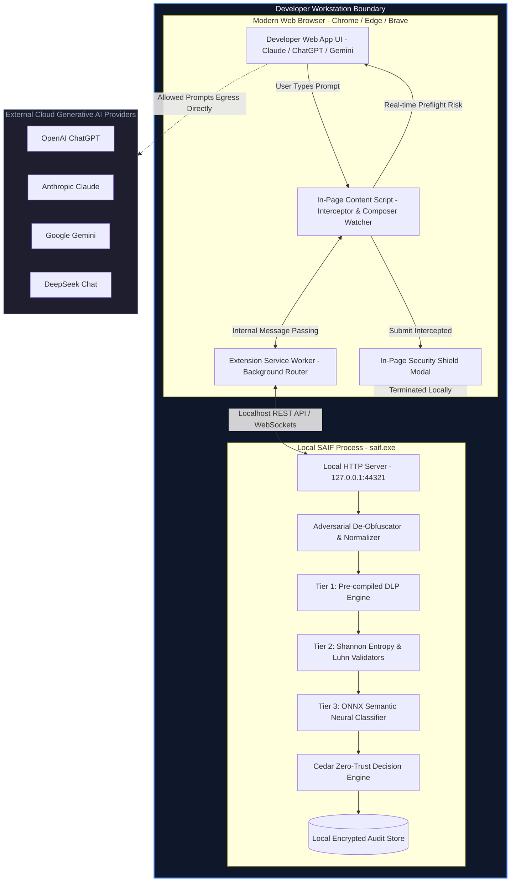
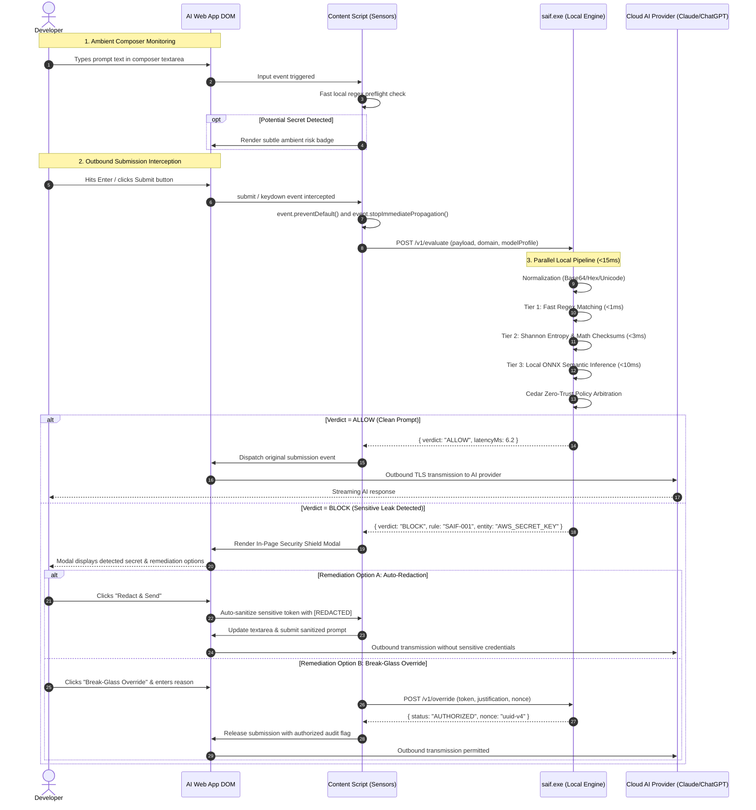
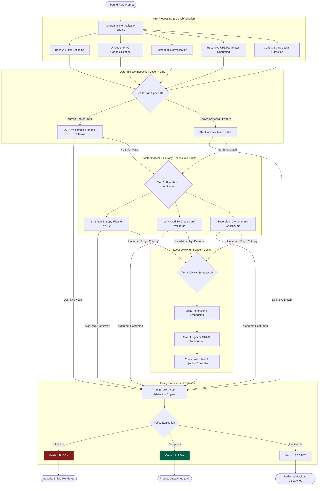
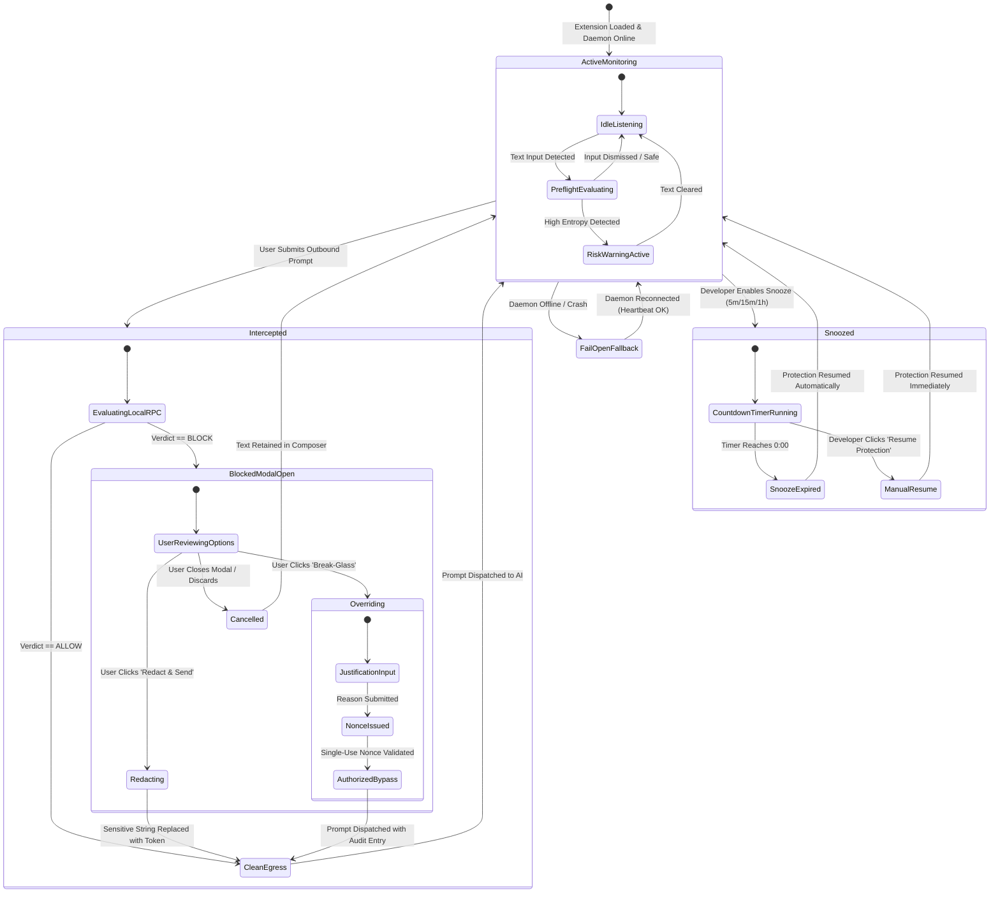
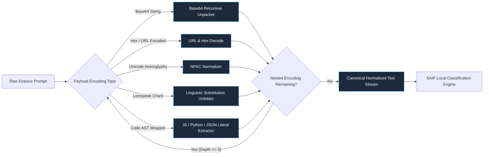

# SAIF Architecture & System Design (Mermaid Diagrams)

> **Documentation Index**:  
> [**Overview**](../README.md) • [**Architecture Diagrams**](ARCHITECTURE.md) • [**User Guide**](USER_GUIDE.md) • [**Benchmark Whitepaper**](BENCHMARK.md) • [**Rule Catalog**](RULE_CATALOG.md) • [**Overrides & Snoozing**](OVERRIDES_AND_SNOOZE.md) • [**FAQ**](FAQ.md) • [**Benchmark Suite**](../benchmark/README.md) • [**Empirical Report**](../BENCHMARK_REPORT.md) • [**Community EULA**](../EULA.md) • [**MIT License**](../LICENSE.md)

---

This document provides visual architectural specifications and data flow models for the **Semantic AI Firewall (SAIF)** using GitHub-native Mermaid diagrams. All diagrams are fully version-controlled, responsive, and rendered natively by GitHub in both light and dark mode.

---

## 1. System Topology & Workstation Boundary

SAIF operates entirely on the local developer workstation. Zero telemetry, raw prompt text, or audit logs ever leave the local machine.

---

## 2. End-to-End Interception Sequence

The sequence below illustrates the lifecycle of an outbound prompt submission, from initial typing through local evaluation, blocking, and optional break-glass developer override.

---

## 3. Multi-Tier Hybrid Inspection Pipeline

SAIF combines deterministic regular expressions, mathematical checksums, and neural ONNX classifiers in a staged cascade to deliver 100% catch rate while maintaining under 15ms P50 latency.

---

## 4. Break-Glass Override & Snooze State Machine

The state diagram below models the operational states of the SAIF workstation sensor, illustrating transitions between active protection, blocking, override authorization, and developer snoozing.

---

## 5. Adversarial Evasion Normalization Pipeline

Attackers and complex developer payloads frequently use nested encoding or AST wrappers to bypass naive string matching. SAIF unrolls these layers before semantic evaluation.

---

## 6. Summary of Architectural Guarantees

| Invariant | Guarantee | Technical Implementation |
| :--- | :--- | :--- |
| **Zero Cloud Egress** | Prompts, regex scans, and neural embeddings never leave workstation memory | 100% local execution in `saif.exe` binding to `127.0.0.1:44321` |
| **Deterministic Fail-Open/Fail-Closed** | Configurable fail posture ensures developers are never unexpectedly blocked | Local heartbeat sensor with configurable posture toggle in dashboard |
| **Sub-15ms Latency** | Interception overhead is imperceptible during daily coding and AI chat | Multi-tier cascade: regex (<1ms) -> Shannon (<3ms) -> ONNX (<10ms) |
| **Audit Nonce Integrity** | Break-glass overrides cannot be forged or replayed | Single-use cryptographic UUID nonces generated by local daemon |
| **Adversarial Resilience** | Resistant to Base64, homoglyph, and template packing attacks | Recursive normalization pipeline unrolling up to 3 nested layers |
