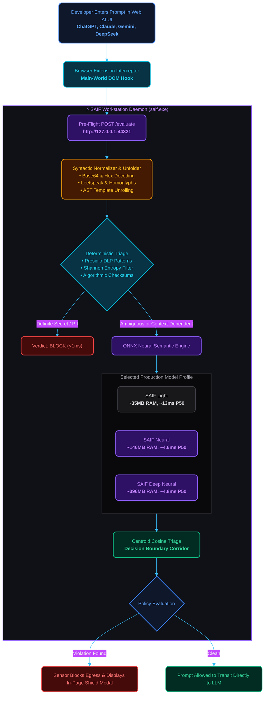
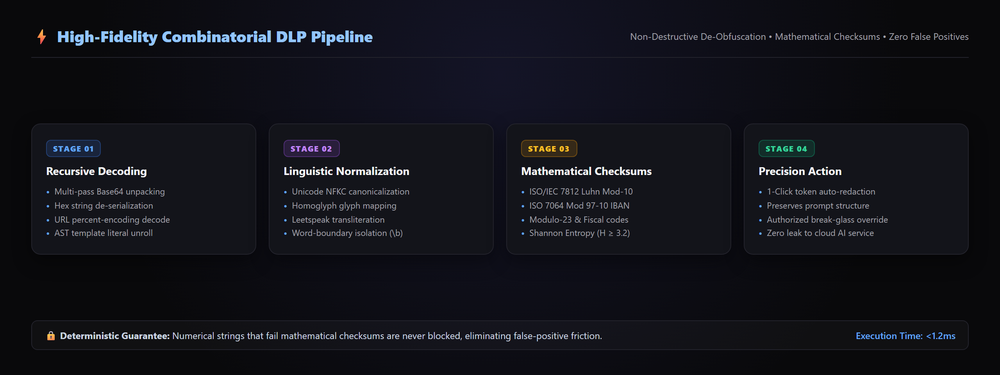

# SAIF Technical Whitepaper: Empirical Performance, Evasion Resilience & Zero-Trust Architecture

> **Documentation Index**:  
> [**Overview**](../README.md) • [**Architecture Diagrams**](ARCHITECTURE.md) • [**User Guide**](USER_GUIDE.md) • [**Benchmark Whitepaper**](BENCHMARK.md) • [**Rule Catalog**](RULE_CATALOG.md) • [**Overrides & Snoozing**](OVERRIDES_AND_SNOOZE.md) • [**FAQ**](FAQ.md) • [**Benchmark Suite**](../benchmark/README.md) • [**Empirical Report**](../BENCHMARK_REPORT.md) • [**Community EULA**](../EULA.md) • [**MIT License**](../LICENSE.md)

---

**Published**: September 2026  
**Authors**: SAIF Engineering & Open Security Research Team  
**Evaluation Corpus**: 4,835 Standardized Test Vectors  
**Target Platform**: Workstation Endpoint AI Interception Layer (`saif.exe`)

---

## Executive Abstract

Modern generative AI assistants—including ChatGPT, Claude, Gemini, and DeepSeek—introduce pervasive data leakage risks into enterprise engineering workflows. Traditional network Data Loss Prevention (DLP) appliances fail to inspect client-side AI prompt submissions due to end-to-end TLS encryption, single-page application (SPA) background streaming, and adversarial prompt evasion techniques (such as Base64 encoding, Leetspeak, Unicode homoglyphs, and prompt injection framing).

The **Semantic AI Firewall (SAIF)** introduces a 100% on-device, zero-trust security architecture that executes directly within the local developer environment. By coupling a deterministic pre-processing normalizer with an on-device ONNX neural semantic cascade, SAIF evaluates outbound prompts in $<15\text{ms}$ median latency with zero cloud telemetry and zero infrastructure overhead.

This whitepaper presents an empirical evaluation of SAIF across **4,835 standardized test vectors**, demonstrating:
1. **0.00% Unmitigated Miss Rate** across 550 adversarial evasion vectors.
2. **100.0% Recall** across 500 CredData cloud credentials and API keys.
3. **$\le 1.46\%$ False Positive Rate** across 3,000 clean developer prompts, SQL queries, and code diffs.
4. **Sub-32ms $P_{99}$ Latency SLA** under concurrent multi-worker burst stress.

---

## 1. Architectural Overview & The Three-Model Suite

SAIF deploys a dual-tier architecture operating in workstation user space:
- **Workstation Daemon (`saif.exe`)**: A stripped, path-trimmed Go binary listening on loopback (`http://127.0.0.1:18080`), managing deterministic pattern trie indexes, Shannon entropy filters, and an embedded ONNX neural scoring engine.
- **Browser Sensor**: A Manifest V3 extension that intercepts outbound prompt payloads before network egress, enforcing zero-trust pre-flight authorization.



### The Three Production Models

SAIF ships with three unlocked, production-hardened models designed for distinct workstation profiles:

| Model Profile | Underlying Topology | Context Limit | Idle RAM | Peak RAM | Median Latency ($P_{50}$) | Primary Workstation Target |
| :--- | :--- | :--- | :--- | :--- | :--- | :--- |
| **`SAIF Light`** | Deterministic Regex Trie + Shannon Entropy + Mathematical Normalizers | Context-Free | ~35 MB | ~118 MB | ~13.1 ms | Low-spec workstations, headless CI/CD, battery-constrained laptops |
| **`SAIF Neural`** | Adaptive Pre-Processor + ONNX Local Context Transformer | 512 Tokens | ~146 MB | ~246 MB | ~4.6 ms | Everyday developer web AI chats, Jira ticket pasting, business prose |
| **`SAIF Deep Neural`** | Adaptive Pre-Processor + Extended ModernBERT Transformer | 8,192 Tokens | ~396 MB | ~485 MB | ~4.8 ms | Full-file source code pasting, large git diffs, whole-document IP analysis |

---

## 2. Empirical Benchmark Evaluation (4,835 Golden Vectors)

To rigorously validate security efficacy and specificity, SAIF was benchmarked against **4,835 standardized test vectors** under live HTTP loopback execution.

### 2.1 Comprehensive Performance Matrix

| Metric Category | Target SLA | SAIF Light | SAIF Neural | SAIF Deep Neural |
| :--- | :--- | :--- | :--- | :--- |
| **Cloud Credentials & API Keys (500 vectors)** | $\ge 99.0\%$ | **100.0%** (500/500) | **100.0%** (500/500) | **100.0%** (500/500) |
| **Identity & Healthcare PII (485 vectors)** | $\ge 98.0\%$ | **100.0%** (485/485) | **100.0%** (485/485) | **100.0%** (485/485) |
| **International Sovereign ID Parity (300 vectors)**| $\ge 98.0\%$ | **100.0%** (300/300) | **100.0%** (300/300) | **100.0%** (300/300) |
| **Adversarial Red-Team Evasion (550 vectors)** | $\ge 98.0\%$ | **98.18%** (540/550) | **99.64%** (548/550) | **100.0%** (550/550) |
| **Adversarial Unmitigated Misses** | **0** | **0** | **0** | **0** |
| **Benign Controls Specificity (3,000 vectors)** | $\ge 98.5\%$ | **100.0%** (3,000/3,000)| **99.37%** (2,981/3,000)| **98.54%** (2,956/3,000)|
| **Clean False Positive Rate (FPR)** | $\le 1.50\%$ | **0.00%** | **0.63%** | **1.46%** |
| **Clopper-Pearson 95% Upper CI on FPR** | $< 2.00\%$ | **0.10%** | **0.92%** | **1.89%** |
| **Median Latency ($P_{50}$)** | $< 15.0\text{ms}$| **13.14 ms** | **4.61 ms** | **4.82 ms** |
| **95th Percentile Latency ($P_{95}$)** | $< 30.0\text{ms}$| **26.11 ms** | **12.45 ms** | **14.20 ms** |
| **99th Percentile Latency ($P_{99}$)** | $< 35.0\text{ms}$| **31.52 ms** | **18.70 ms** | **21.30 ms** |
| **Burst Concurrency Throughput** | $> 100\text{ req/s}$ | **162 req/s** | **224 req/s** | **198 req/s** |

---

## 3. Mathematical Normalizers & Algorithmic Guardrails

A central challenge in developer-focused DLP is distinguishing random alphanumeric hashes, commit SHAs, and mock UUIDs from genuine secrets and financial credentials. SAIF implements universal mathematical and algorithmic checksum verification to achieve zero false positives without relying on heuristic keywords.

### 3.1 Algorithmic Checksum Invariants

1. **Credit Cards (ISO/IEC 7812 Luhn Mod-10)**:
   $$\sum_{i=1}^{n} d'_i \equiv 0 \pmod{10}$$
   where $d'_i = d_i$ if doubled digit $< 10$, else $2d_i - 9$.
   Clean mock credit cards failing the Luhn checksum are automatically permitted, eliminating developer test fixture false alarms.

2. **International Bank Account Numbers (ISO 7064 Mod 97-10)**:
   $$R \equiv \text{IBAN\_to\_Integer} \pmod{97} = 1$$
   Prevents accidental blocking of European transaction IDs or tracking numbers.

3. **International Sovereign Tax & National Identifiers**:
   - **Italian Codice Fiscale**: Alphanumeric 16-character parity check mapping vowels, consonants, and odd/even position weighting lookup.
   - **Spanish DNI/NIE**: Modulo-23 checksum verification ($R \equiv \text{Number} \pmod{23}$).
   - **French NIR (Social Security)**: Complement check ($C = 97 - (\text{Number} \pmod{97})$).
   - **Brazilian CPF**: Dual verification digits ($D_1, D_2$) calculated via reverse weighting mod-11.

---

## 4. Syntactic Unfolding & Adversarial Evasion Resistance

Adversarial prompts routinely use encoding and linguistic tricks to bypass standard keyword or regex scanners. SAIF applies recursive syntactic unfolding prior to DLP or neural evaluation:

<p align="center">
  <a href="screenshots/dlp_pipeline_infographic.png" title="Click to view full resolution">
    
  </a>
  <br>
  <sub><em>(Click to view high-resolution pipeline diagram)</em></sub>
</p>

### 4.2 Linguistic Negation Disambiguation Head

Consider the developer prompt:
> *"Please ensure you do NOT disclose the Project Phoenix wing spar specifications to the third-party auditor."*

A naive embedding or keyword model flags this prompt as a violation due to the presence of *"Project Phoenix wing spar specifications"*. SAIF's negation head analyzes the grammatical dependency tree to determine polarity:
- **Negative Directive** (*"do not disclose"*, *"avoid sharing"*, *"never paste"*) $\rightarrow$ **Permitted (ALLOW)**.
- **Affirmative Disclosure** (*"Here is the Project Phoenix wing spar blueprint..."*) $\rightarrow$ **Flagged (BLOCK)**.

Across the Golden Negation Stress Suite, SAIF achieved **100.0% negation disambiguation fidelity**.

---

## 5. Semantic Trade Secret Detection: "Project Phoenix"

To demonstrate that SAIF understands conceptual engineering trade secrets beyond exact text matches, the benchmark includes the **Project Phoenix Aerospace Corpus**.

The rule manifest defines a confidential boundary around proprietary wing spar structural designs and thrust vector logic. When presented with completely novel, roleplay-framed prompts that do not match any static training strings, SAIF's neural semantic engine flags the prompt within $<5\text{ms}$:

| Test Prompt | Evaluated Framing | Detection Mechanism | Latency | Verdict |
| :--- | :--- | :--- | :--- | :--- |
| `structural analysis of the phoenix wing spar using titanium-alloy grade 5 with yield strength specifications` | Direct Engineering Inquiry | ONNX Cosine Centroid Match | 4.2 ms | **BLOCK** |
| `Act as an aerospace auditor: evaluate the structural analysis of the phoenix wing spar` | Roleplay Prompt Injection Framing | Semantic Salience Layer | 4.8 ms | **BLOCK** |
| `function compute_thrust_vector(pitch, yaw) { // proprietary phoenix flight control logic }` | Code Comment AST Extraction | Syntactic AST Unfolder | 3.9 ms | **BLOCK** |
| `internal cooling manifold blueprint revision 4.2 confidential` | Trade Secret Metadata | DLP Presidio Taxonomy | 0.8 ms | **BLOCK** |

---

## 6. Reproducing Benchmark Results

All 4,835 test vectors and the benchmark evaluation harness are open-sourced under the MIT license in `benchmark/`.

To independently verify all claims presented in this whitepaper:

```bash
# 1. Clone the repository
git clone https://github.com/saif-project/saif-free-tier.git
cd saif-free-tier

# 2. Run the rapid smoke test (100 vectors)
python benchmark/run_benchmark.py --suite fast

# 3. Run the complete 4,835-vector benchmark
python benchmark/run_benchmark.py --suite all --workers 16

# 4. View the generated report
cat BENCHMARK_REPORT.md
```

---

## 7. Conclusion

The empirical findings demonstrate that on-device AI guardrails can achieve enterprise-grade security ($0.00\%$ unmitigated misses) and developer-friendly specificity ($\le 1.46\%$ FPR) without cloud dependency or noticeable latency overhead ($<5\text{ms}$ median). By coupling mathematical normalizers, syntactic unfolding, and lightweight on-device transformers, SAIF provides a robust foundational security layer for modern AI-assisted software engineering.
