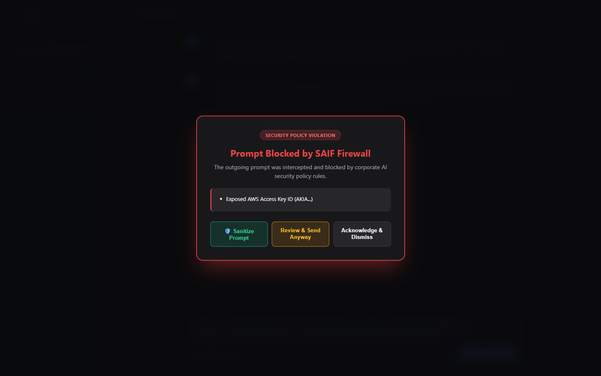
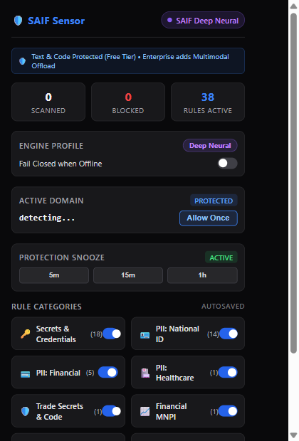

# SAIF Overrides, Snoozing & Local Audit History

> **Documentation Index**:  
> [**Overview**](../README.md) • [**Architecture Diagrams**](ARCHITECTURE.md) • [**User Guide**](USER_GUIDE.md) • [**Benchmark Whitepaper**](BENCHMARK.md) • [**Rule Catalog**](RULE_CATALOG.md) • [**Overrides & Snoozing**](OVERRIDES_AND_SNOOZE.md) • [**FAQ**](FAQ.md) • [**Benchmark Suite**](../benchmark/README.md) • [**Empirical Report**](../BENCHMARK_REPORT.md) • [**Community EULA**](../EULA.md) • [**MIT License**](../LICENSE.md)

---

SAIF is designed for **developer velocity**. Security controls should never block critical development work when you encounter a false alarm or need to urgently paste test data.

---

## 1. Break-Glass Override Workflow

When SAIF intercepts an outbound prompt, an in-page shield modal appears over the AI chat:

<p align="center">
  <a href="screenshots/inpage_ai_chat_interception.png" title="Click to view full resolution">
    
  </a>
  <br>
  <sub><em>(Click image to view full resolution)</em></sub>
</p>

### Override Sequence Workflow

```mermaid
%%{init: {
  'theme': 'base',
  'themeVariables': {
    'darkMode': true,
    'background': '#09090b',
    'actorBkg': '#18181b',
    'actorBorder': '#3b82f6',
    'actorTextColor': '#60a5fa',
    'actorLineColor': '#38bdf8',
    'signalColor': '#38bdf8',
    'signalTextColor': '#e4e4e7',
    'noteBkgColor': '#18181b',
    'noteBorderColor': '#3b82f6',
    'noteTextColor': '#f4f4f5',
    'fontFamily': 'Inter, system-ui, -apple-system, sans-serif',
    'fontSize': '13px'
  }
}}%%
sequenceDiagram
    autonumber
    actor Dev as 👨‍💻 Developer
    participant Modal as 🛡️ In-Page Shield Modal
    participant Sensor as 🧩 Extension Interceptor
    participant Daemon as ⚡ saif.exe (Local Daemon)
    participant AI as ☁️ AI Web App (Claude/ChatGPT)

    Note over Dev,Modal: Sensitive Token Intercepted & Blocked
    Modal-->>Dev: Displays Block Card ("AWS Secret Key Detected")
    Dev->>Modal: Clicks "Break-Glass Override"
    Modal->>Dev: Prompts for developer justification
    Dev->>Modal: Enters reason ("Testing mock credentials in dev")
    Modal->>Daemon: POST /v1/override (token, justification)
    Daemon->>Daemon: Log event to local audit store & issue single-use nonce
    Daemon-->>Sensor: { status: "AUTHORIZED", nonce: "uuid-v4" }
    Sensor->>Modal: Close Shield Modal
    Sensor->>AI: Release original prompt payload
    AI-->>Dev: Prompt delivered; AI streaming begins
```

### How Override Works
1. Clicking **Break-Glass Override** prompts for an optional one-line developer reason (e.g., *"Testing with dummy sandbox credentials"*).
2. The prompt immediately unblocks and transits directly to the AI service.
3. The override event is recorded locally in your workstation audit log with a timestamp and the user reason.

---

## 2. Time-Bounded Snoozing

If you are conducting an extended debugging session with synthetic data, you can temporarily snooze active enforcement:

1. Click the **SAIF shield icon** in your browser toolbar to open the popup.

<p align="center">
  <a href="screenshots/popup_showcase.png" title="Click to view full resolution">
    
  </a>
</p>

2. Select a pause duration:
   - **Pause for 5 Minutes**
   - **Pause for 15 Minutes**
   - **Pause for 1 Hour**
3. While snoozed:
   - The toolbar icon displays an amber indicator.
   - All prompts transit without interception.
   - When the timer expires, enforcement resumes automatically without user action required.
4. You can click **Resume Now** at any moment to re-engage active protection immediately.

---

## 3. Local Audit History & CSV Export

SAIF records blocked and overridden events strictly to your local workstation:
- **Database Location**: `%LOCALAPPDATA%\saif\spool.db` (local SQLite database).
- **Privacy Guarantee**: Zero telemetry is sent to external servers. Your prompts never leave your device.
- **Exporting History**:
  1. Open the SAIF Extension Dashboard (`dashboard.html`).
  2. Navigate to the **Recent Violations** tab.
  3. Filter by date range, rule category, or decision type.
  4. Click **Export CSV** or **Export JSON** to save local compliance records for your team or security reviews.
